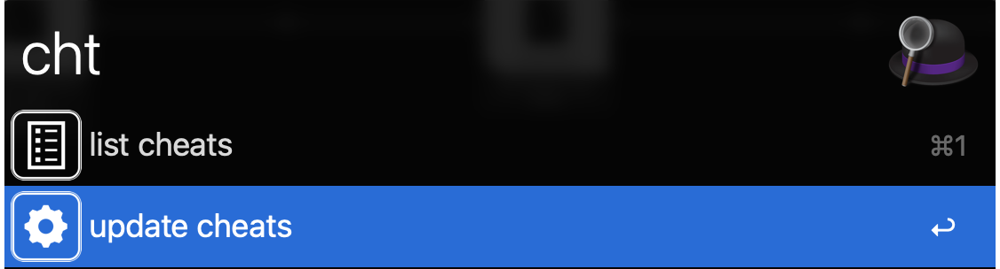

# Alfred Cheat.sh  

Access your favourite cheat sheets from [cheat.sh](http://cheat.sh) directly from Alfred.  

# Usage  
The main workflow is accessd throught the keyword `cht`:  

https://user-images.githubusercontent.com/13389074/151710831-2e295aaa-7f27-47bb-9608-cea5411de36c.mp4

The selected cheat sheet will be copied to your clipboard.  

On the first usage, the workflow will ask you to update the avaliable cheat sheets because it compiles a lista of avaliable items and caches it on the Work Flow Data folder for faster results. At anytime you could update the list throught the menu `update cheats`:  
  
  

# Requirements
This workflow require you to have `jq` avaliable on your system.  

To check if they're avaliable on your system open a terminal and type:  
```Shell
which jq
```  

The expected result is similar to:  

```Shell
/usr/local/bin/jq
```  

# Limitations
The main workflow doesn't support cheat sheets for programming languages or special pages like `:help` from cheat.sh (mainly because of the huge ammount of things that must be escaped to properly load as json).  

If you want to acccess this type of content you could use the `fcht` keyword and it will print the full cheat sheet on your terminal instead.  

## Download
Check the [releases page](https://github.com/gohoyer/Alfred-Cheat.sh/releases) to download it.
